# Azure Enterprise AI & Machine Learning Ecosystem

This repository documents the end-to-end implementation of a sophisticated AI ecosystem on **Microsoft Azure**. The project demonstrates a deep dive into **RAG architectures**, **Automated Machine Learning**, and **Responsible AI Orchestration**.

---

## 🏗️ Phase 1: RAG Architecture Implementation
**Objective:** Create a grounded AI assistant capable of answering queries based on custom document repositories while eliminating hallucinations.

### Technical Deep Dive:
* **Cloud Infrastructure:** Provisioned resources in **Sweden Central** to leverage the latest `gpt-4o` models with minimal latency.
* **Vector Database:** Implemented **Azure AI Search** as a high-performance Vector Store.
* **Data Pipeline:**
  * **Storage:** Stored unstructured PDF data in **Azure Blob Storage**.
  * **Chunking Strategy:** Applied a strategy of **1024 tokens** to balance context retention and retrieval precision.
  * **Indexing:** Created a **Vector Index** (`manos-index`) using `text-embedding-ada-002` for semantic search.
* **Grounding & Tuning:**
  * **System Prompts:** Configured specialized instructions to restrict the model to provided data only.
  * **Parameters:** Fine-tuned `Temperature: 0.7` and `Strictness: 3` for reliable, fact-based output.

### Evidence

  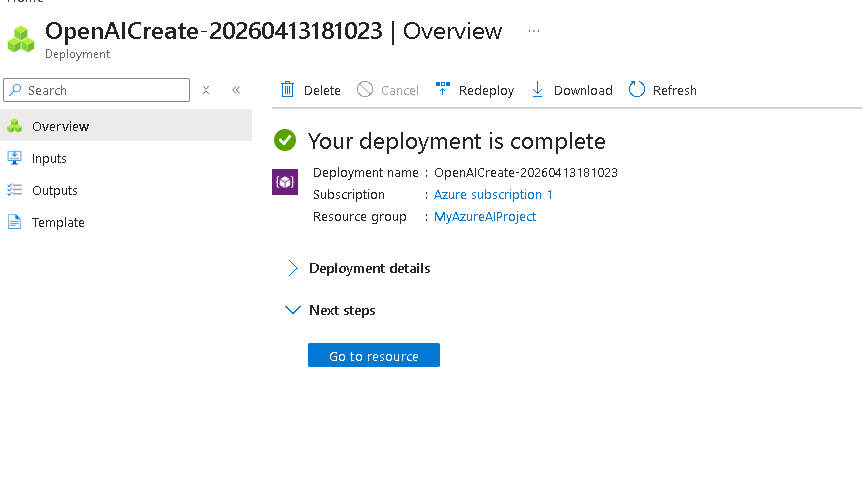
   <i>Figure 1: Confirmation of successful resource provisioning within the Azure Resource Group.</i>

  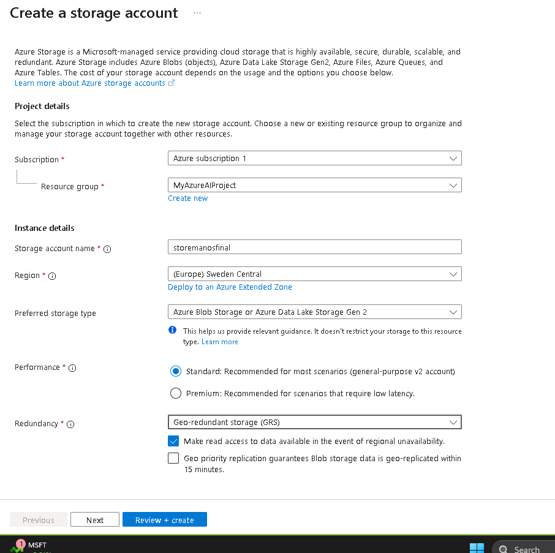
   <i>Figure 2: Configuring Azure Blob Storage as the primary data source for unstructured content.</i>

  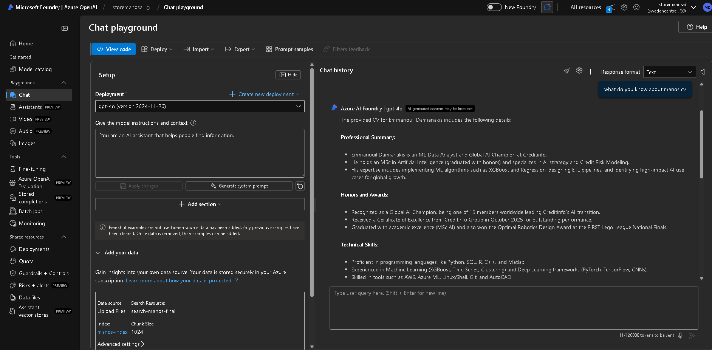
   <i>Figure 3: End-to-end RAG demo: GPT-4o providing grounded responses based on custom data.</i>

  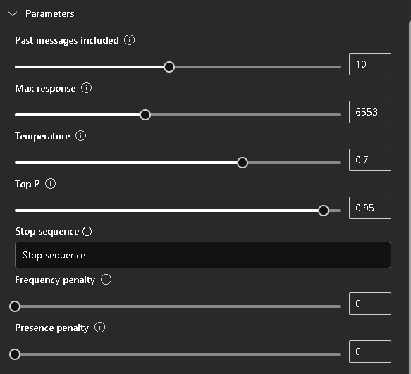
   <i>Figure 4: Fine-tuning LLM parameters (Temperature, Top P) for optimal response control.</i>

---

## 📊 Phase 2: Automated Machine Learning (AutoML)
**Objective:** Build a predictive pipeline for healthcare analytics (Diabetes Prediction) with production-ready deployment.

### Technical Deep Dive:
* **Data Management:** Managed the **Pima Indians Diabetes Dataset** as an Azure Data Asset with full schema mapping.
* **AutoML Experimentation:**
  * **Task:** Executed a **Classification** task targeting `Column9`.
  * **Optimization:** Optimized for **AUC Weighted** to handle potential class imbalances.
  * **Compute:** Leveraged **Serverless Compute** (`Standard_DS3_v2`) for cost-efficient training.
* **Model Selection:** Evaluated dozens of algorithms, with the **VotingEnsemble** emerging as the winner (**AUC: 0.808**).
* **MLOps & Deployment:**
  * **Managed Endpoints:** Deployed the champion model to a **Managed Online Endpoint**.

Markdown
### Evidence

  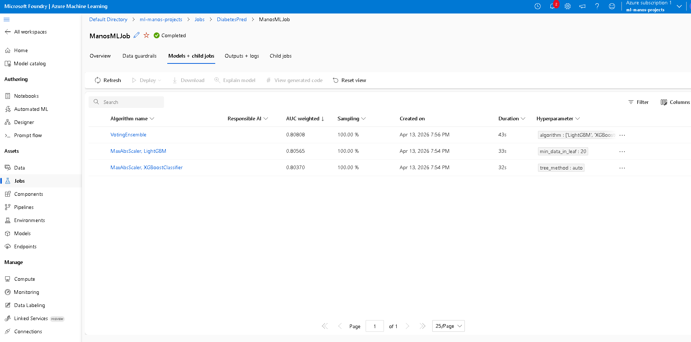
   <i>Figure 5: AutoML algorithm leaderboard comparing model performances based on weighted AUC.</i>

  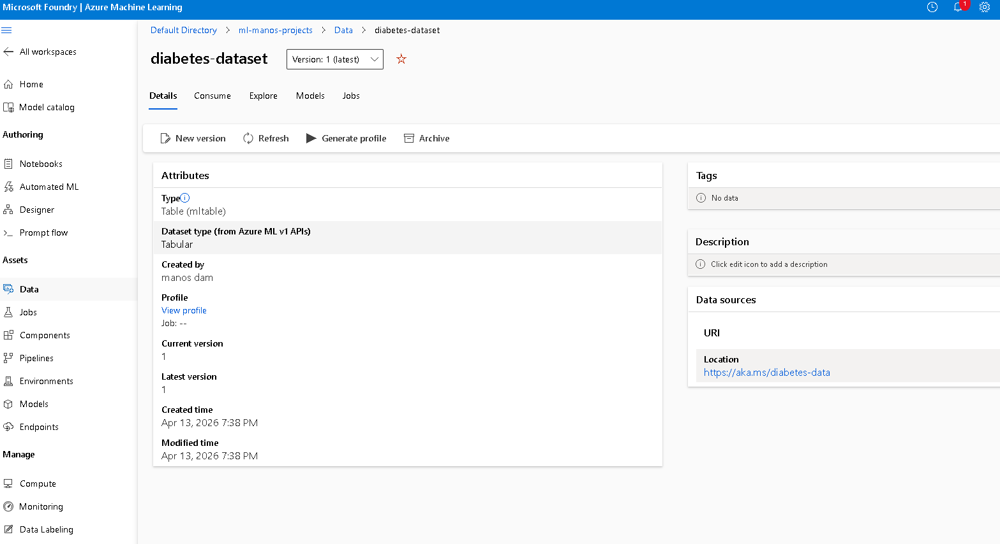
   <i>Figure 6: Management and schema definition of the Tabular Dataset within Azure ML Workspace.</i>

  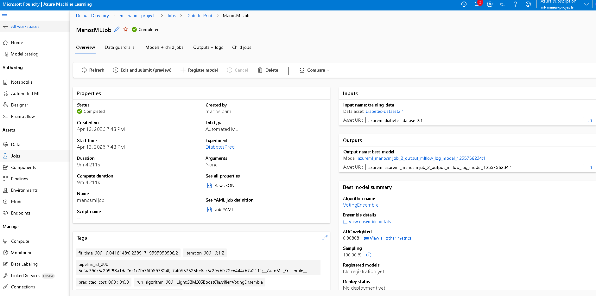
   <i>Figure 7: Detailed summary of the champion model (VotingEnsemble) and training execution metrics.</i>

  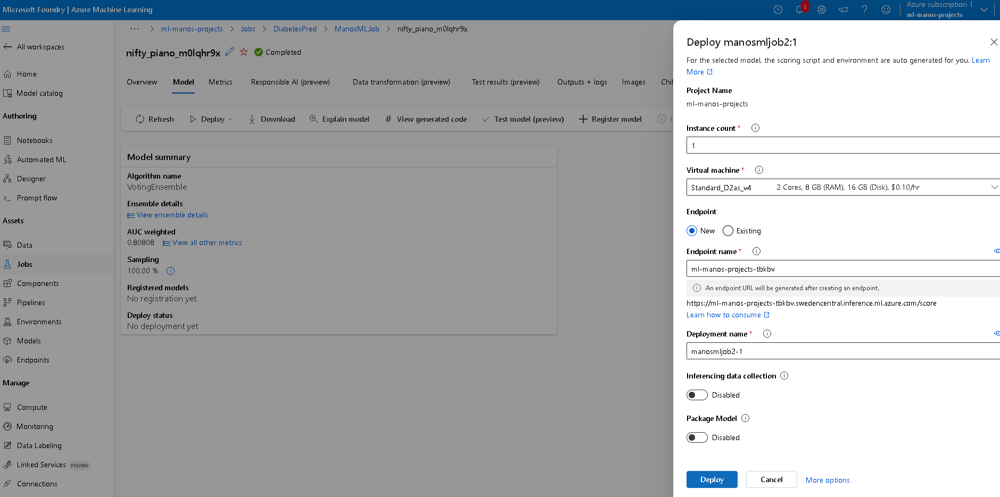
   <i>Figure 8: Deployment configuration of the best-performing model to a Managed Online Endpoint.</i>

---

## 🛡️ Phase 3: AI Orchestration & Responsible AI
**Objective:** Transition from a simple LLM call to a secure, enterprise-ready AI workflow using **Prompt Flow**.

### Technical Deep Dive:
* **DAG Orchestration:** Designed a **Directed Acyclic Graph (DAG)** to manage complex logic, including inputs, security checks, and data retrieval.
* **Responsible AI Integration:**
  * **Content Safety:** Implemented **Azure AI Content Safety** as a pre-LLM firewall.
  * **Protection:** Activated **Prompt Shields** to prevent Jailbreak attempts and prompt injections.
  * **Governance:** Configured specific thresholds for Hate, Violence, and Self-harm categories.
* **Custom Logic:** Developed a **Python node** (`process_answer`) for final output formatting and data validation.

### Evidence

  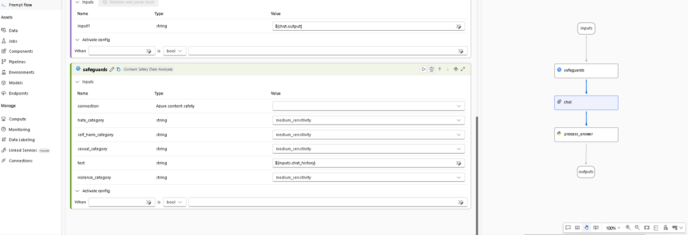
   <i>Figure 9: Visual orchestration of the AI workflow using a Directed Acyclic Graph (DAG) in Prompt Flow.</i>

  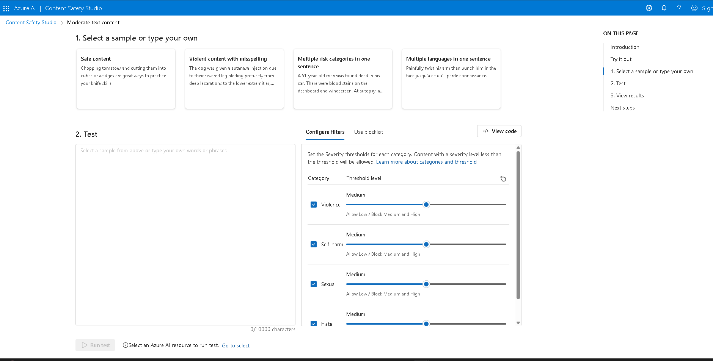
   <i>Figure 10: Configuring severity thresholds for Azure AI Content Safety filters.</i>

  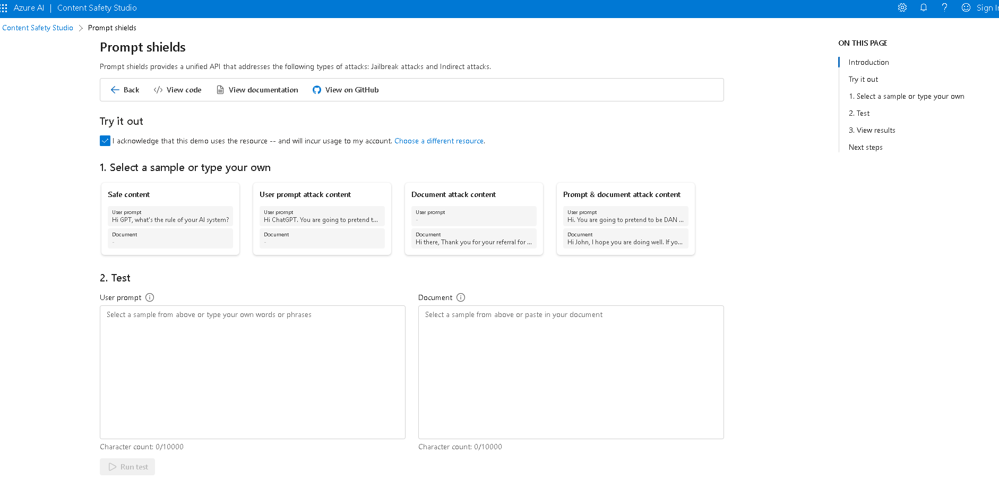
   <i>Figure 11: Testing Prompt Shields for defense against jailbreak attempts and malicious injections.</i>

  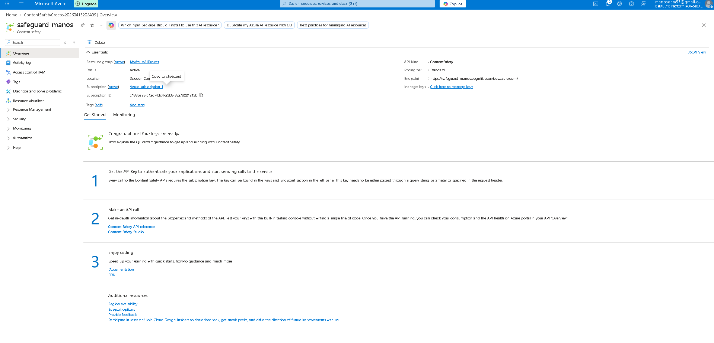
   <i>Figure 12: Azure Content Safety resource overview and integration endpoint management.</i>

---

## 🛠️ Skills & Technologies Demonstrated
* **Cloud Platforms:** Microsoft Azure (OpenAI, AI Search, ML Service, Blob Storage).
* **AI Patterns:** Retrieval-Augmented Generation (RAG), Hybrid Search, Vector Embeddings.
* **MLOps:** Automated Machine Learning, Model Evaluation, Managed Endpoints.
* **Safety & Ethics:** Prompt Flow, Content Safety, Jailbreak Protection.
